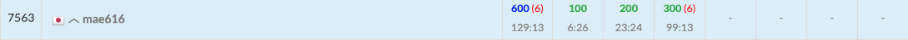

初参加。
事前に入力値の取り方とかのテンプレートをファイル保存してたので、それは個人的によかったなと思いました。

https://atcoder.jp/contests/abc366



# A
ベストプラクティスではないけれど、これはできました。

youtubeの解説動画
https://www.youtube.com/watch?v=RAwQ_snLPtg
を見ると
`t` か `a` が `n` の過半数かを判定すればよかったらしいので、その方が綺麗だったなと思いました。
```javascript
function main(input) {
  const [n, t, a] = input.split(' ').map(item => Number(item));
  
  if(t === a){
    console.log("No");
    return;
  }
  
  if(t > a){
    if(t < a + (n - (t + a))){
      console.log("No");
      return;
    }
  }else{
    if(a < t + (n - (t + a))){
      console.log("No");
      return;
    }
  }

  console.log("Yes");
}

main(require('fs').readFileSync('/dev/stdin', 'utf8'));
```

# B
コードは汚いけど、こう言う問題は比較的大丈夫なので、すんなりいきました。

```javascript
function main(input) {
  const args = input.split('\n');
  const n = Number(args.shift());
  const strs = args;
  
  const l = strs.reduce((max, current)=>Math.max(max, current.length), 0);

  for(let j=0; j<l; j++){
    let outputStr = "";
    let flg = false;
    let count = 0;
    for(let i=n-1; i>=0; i--){
      if(strs[i].length <= j){
        flg = true;
        count++;
      }else{
        if(flg){
          outputStr += "*".repeat(count);
          flg=false;
          count=0;
        }
        outputStr += strs[i][j];
      }
    }
    console.log(outputStr);
  }
}

main(require('fs').readFileSync('/dev/stdin', 'utf8'));
```

# C
ここでTLEを6回だして、止まってしまった。  
しかもその後最後のmainの実行コードが消えてしまったのに気づかず、「動かない」とあたふたしてしまった。  
最後の1分前にようやくAC。  
素直に考えられなかったのと、計算量を考慮することが苦手だと自覚しました。

```javascript
function main(input) {
  const args = input.split('\n');
  const q = Number(args.shift());
  const nums = args;
  
  let c = 0;
  const hoge = {};
  for(let i=0; i<q; i++){
    const [num, ball] = nums[i].split(" ").map(item => Number(item));
    
    if(num === 1){
      if(ball in hoge === false){
        hoge[ball] = 1;
        c++;
      }else{
        hoge[ball]++;
      }
    }else if(num === 2){
      if(hoge[ball] === 1){
        c--;
        delete hoge[ball];
      }else{
        hoge[ball]--;
      }
    }else{
      console.log(c);
    }
  }
}
main(require('fs').readFileSync('/dev/stdin', 'utf8'));
```


---
できれば来週までに、辿り着かなかった問題について
youtubeの解説動画
https://www.youtube.com/watch?v=RAwQ_snLPtg
を軽く見ておきたい。

それを続けていけば、少しづつ解ける問題が増えるのではないかと思った。
心理的にハードルが高く、目を通せなかったらとりあえず解説は置いといて、ただ参加するをしばらく余裕が出るまで続けてから考える。