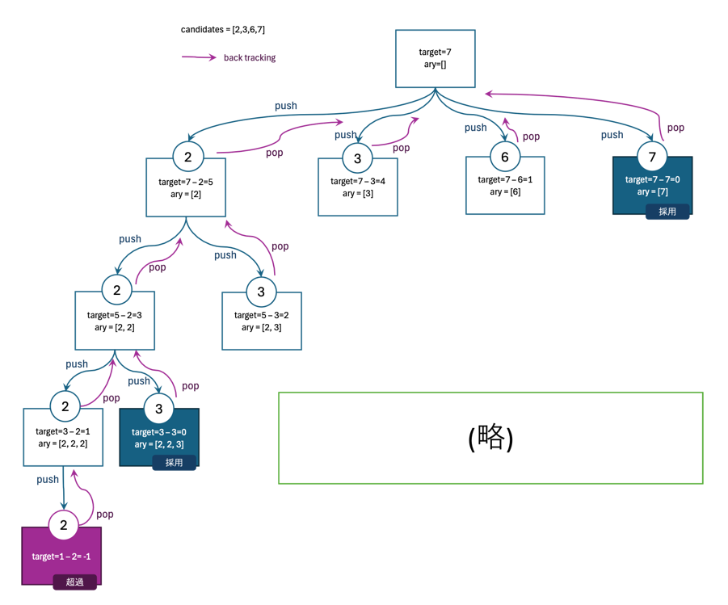

# 問題

https://leetcode.com/problems/combination-sum/description/

例: 入力例1 
```
Input:  candidates = [2,3,6,7], target = 7
Output: [[2,2,3],[7]]
```

足して`target`になる`candidates`の組み合わせを求める。
`candidates`は同じ数を2回以上使っても良い。

# 解答
```javascript
/**
 * @param {number[]} candidates
 * @param {number} target
 * @return {number[][]}
 */
var combinationSum = function(candidates, target) {
    const result = [];

    candidates.sort((a, b) => a - b);

    const backtrack = (start, target, ary) => {
        if (target === 0) {
            result.push([...ary]);
            return;
        }

        for (let i = start; i < candidates.length; i++) {
            if (candidates[i] > target) break;

            ary.push(candidates[i]);
            backtrack(i, target - candidates[i], ary);
            ary.pop();
        }
    };

    backtrack(0, target, []);
    return result;
};

```

# 考え方


配列を使い回すのかな...？

# バックトラッキングとは
バックトラッキング（Backtracking）は、問題を解くための一般的なアルゴリズム手法の一つで、特に組み合わせ的な問題に対して有効です。以下にバックトラッキングの基本的な概念を説明します。

### バックトラッキングの基本概念

1. **探索木の構築**:
   - 問題を部分問題に分けて解決する際に、すべての可能な解決策を探索するための「探索木」を構築します。
   - 各ノードは部分的な解決策を表し、子ノードは次のステップでの可能な選択を示します。

2. **再帰的な探索**:
   - 再帰を用いて、探索木を深さ優先で探索します。
   - 現在の部分的な解決策が完全な解決策になるかどうかをチェックします。

3. **条件のチェック**:
   - 解決策が条件を満たさない場合、そのノードとその子孫ノードを探索することなく、探索を打ち切ります（これを「枝刈り」と言います）。

4. **解の構築とバックトラック**:
   - 有効な解が見つかった場合、それを記録します。
   - その後、探索を元に戻して他の可能性を探索します（これが「バックトラック」）。

### バックトラッキングの用途

バックトラッキングは、次のような問題に適しています。

- パズル（例：ナイトツアー、数独）
- 組み合わせ最適化（例：ナップサック問題）
- グラフ探索（例：迷路探索）
- 部分集合や順列の生成

バックトラッキングは、全体の解空間を探索しながら、不要な探索を効率的に省くことで、計算量を削減し、問題を解決するのに役立ちます。